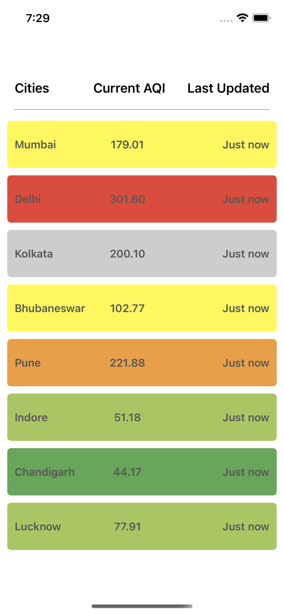
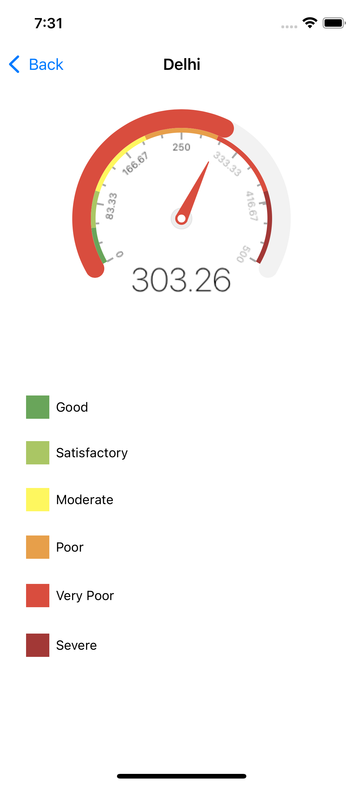

## ProximityAQI Project Assignment
Project Assignment by Syed Faran Ghani

## Getting Started
- Open `ProximityAQI.xcodeproj` in Xcode 12.0+
- Build and Run project 

## Project is developed in Swift 5

## Screenshots

## Architecture
MVVM architecture is used.

## Core Logic
City wiise Air quality index data is fetched from websocket server and displayed in tableView in CityWiseAQIViewController class 
Guage view is used to display air quality index of selected city in a gauge like chart.

